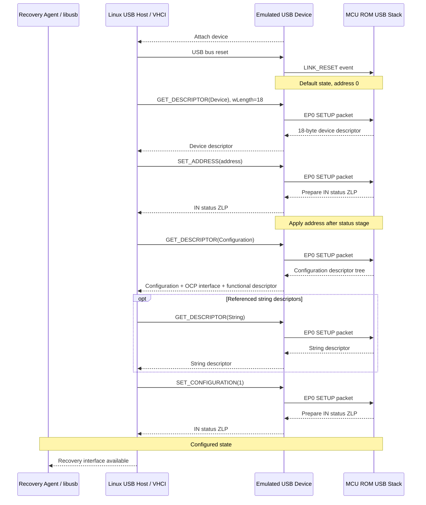
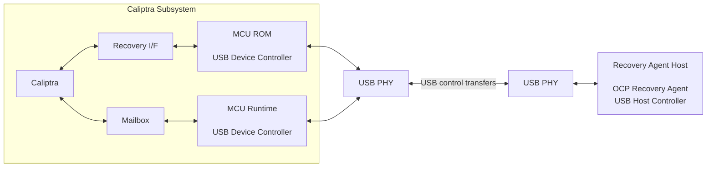
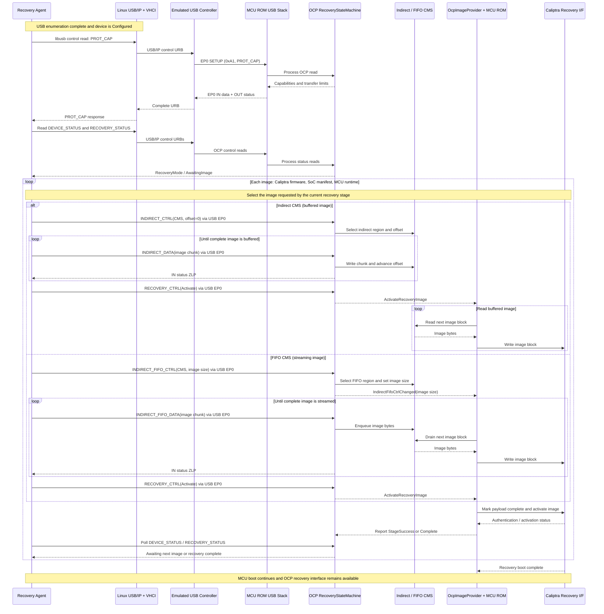
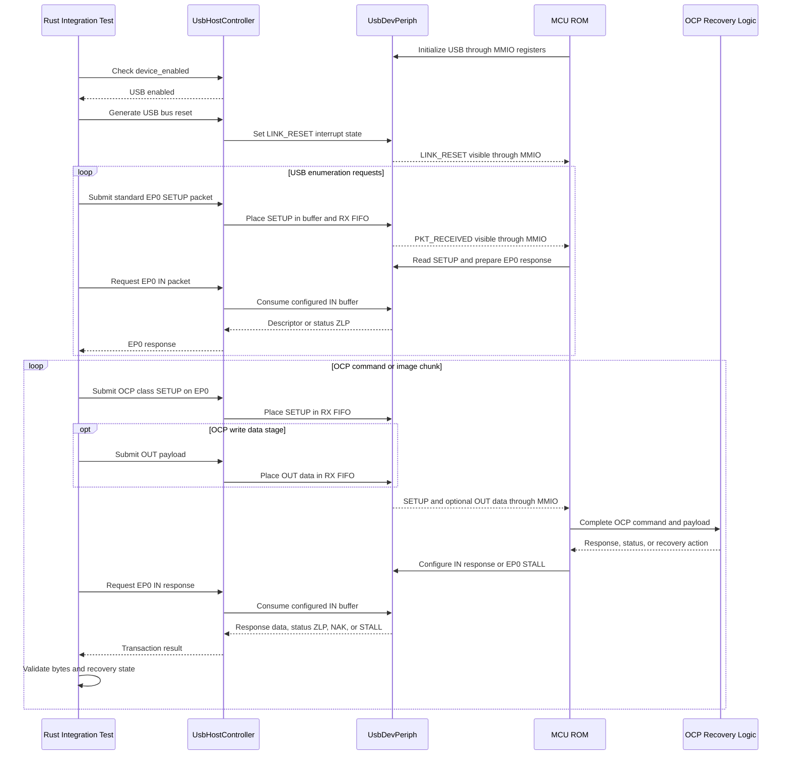

# USB Recovery Emulation Design

## 1. Purpose

This document defines how to develop and validate OCP Secure Firmware Recovery over USB before the VCK190 USB RTL is available. The design provides a software model of the USB device controller used by the RISC-V CPU, a host-side recovery-agent connection, and a migration path that preserves the RISC-V firmware when RTL and a USB PHY become available.

The repository already contains the first, in-process version of this architecture:

- an OpenTitan-derived `usbdev` register map;
- an MMIO peripheral model connected to the RISC-V emulator;
- a reference RISC-V USB device driver;
- OCP USB descriptors, SETUP-packet parsing, and a transport-independent recovery state machine; and
- integration tests that enumerate the device and transfer recovery images.

The remaining design work is primarily to expose the emulated USB host outside the test process, complete USB control-transfer semantics, and establish RTL parity criteria.

## 2. Goals and non-goals

### 2.1 Goals

1. Run the same RISC-V USB driver and OCP Recovery logic against emulated and FPGA USB controllers.
2. Let the production-style recovery-agent application access the emulated device through USB/IP and `libusb`.
3. Validate enumeration, EP0 control transfers, OCP command handling, image streaming, recovery activation, reset, STALL, and timeout behavior.
4. Keep USB transaction handling deterministic while presenting the device through the Linux USB/IP infrastructure.
5. Present the emulated device to Linux through USB/IP so an unmodified `libusb` recovery agent can be tested.
6. Make known differences between transaction-level emulation and physical USB explicit.

### 2.2 Non-goals

The base emulator will not model D+/D- signaling, PHY analog behavior, NRZI encoding, bit stuffing, packet CRC generation, electrical timing, hub behavior, or signal integrity. Those require RTL simulation, FPGA testing, USB protocol analyzers, and USB compliance testing.

Bulk or interrupt endpoints are not required by OCP Recovery v1.1. The initial implementation is EP0-only. Other composite-device interfaces are outside this design except that their absence or STALL behavior must not prevent access to the recovery interface.

## 3. References

- [OCP Secure Firmware Recovery Specification v1.1](../../ocp-recovery-document-1p1-final.md), especially sections 8.5, 8.5.1 through 8.5.6, and section 9.
- [OCP Recovery Integrator Guide](./ocp_recovery_integrator_guide.md).
- [Network Recovery Boot](./network_boot.md), used as the repository pattern for separating an emulated peripheral from a host backend.
- USB 2.0 specification, chapters 5, 8, and 9.
- OpenTitan `usbdev` programming model represented by `hw/usbdev.rdl`.

## 4. Terminology

| Term                | Meaning in this document                                                                                               |
| ------------------- | ---------------------------------------------------------------------------------------------------------------------- |
| Device              | The Caliptra MCU subsystem exposing OCP Recovery over USB. It is always a USB device, not a USB host.                  |
| Recovery Agent (RA) | Host software that discovers the recovery interface and sends OCP Recovery commands and images.                        |
| EP0                 | The mandatory bidirectional USB control endpoint.                                                                      |
| USB controller      | RTL or emulator peripheral that presents the`usbdev` MMIO register contract to RISC-V firmware.                      |
| USB device driver   | RISC-V firmware that owns enumeration, EP0 buffers, and control-transfer state.                                        |
| OCP state machine   | Transport-independent command, status, CMS, and activation logic in`common/ocp`.                                     |
| CMS                 | Component Memory Space exposed by OCP Recovery, using indirect or FIFO access.                                         |
| USB/IP adapter      | Emulator component that exports the emulated controller as a USB/IP device and translates URBs into host transactions. |

## 5. USB protocol overview

### 5.1 Topology and roles

USB is host scheduled. The RA's host controller initiates every transfer; the recovery device never sends a packet without first receiving an IN token. The device advertises its presence, responds to enumeration, and then accepts class-specific OCP requests on EP0.

This differs from network boot. In network boot, firmware is a network client that discovers a server and downloads images. In USB Recovery, MCU firmware is the USB device and OCP responder, while an external RA pushes or reads recovery data.

### 5.2 Enumeration

After attach and bus reset, the device enters the Default state at address zero. A minimum enumeration sequence is:

A robust implementation must also tolerate repeated and short descriptor reads, a new SETUP packet aborting an active control transfer, and a bus reset at any point.

### 5.3 EP0 control transfers

Every control transfer begins with an eight-byte SETUP packet and has one of these forms:

**Control write, host to device**

1. SETUP packet with direction OUT and actual payload length in `wLength`.
2. Zero or more OUT data packets.
3. Device returns an IN zero-length packet (ZLP) as status.

**Control read, device to host**

1. SETUP packet with direction IN and requested maximum length in `wLength`.
2. Device returns zero or more IN data packets.
3. Host sends an OUT ZLP as status.

For the current Full-Speed-style `usbdev` model, EP0 maximum packet size is 64 bytes. A transfer may be larger than one packet. All non-final data packets are 64 bytes. A short packet or required ZLP terminates a device-to-host data stage before `wLength`; receiving exactly `wLength` also terminates it.

A SETUP packet resets EP0 data toggles and clears an endpoint halt for the new control transfer. NAK means the endpoint is temporarily not ready and should be retried. STALL means the request cannot be serviced and requires host recovery.

### 5.4 What the transaction-level emulator validates

The emulator validates software-visible behavior:

- MMIO register programming;
- buffer ownership and FIFO depth;
- endpoint enable, NAK, STALL, and ready state;
- packetization at EP0 maximum packet size;
- interrupt status and clearing behavior;
- enumeration and control-transfer state;
- OCP framing, state transitions, and image flow; and
- reset and software error recovery.

CRC, PID, and bit-stuffing failures are represented by fault-injection events and status bits rather than calculated from a serial bitstream.

## 6. OCP Recovery over USB

### 6.1 High-level boot architecture

Unlike network recovery, USB recovery does not use a separate boot coprocessor.
MCU ROM runs the USB device stack and OCP recovery responder. The host-side
Recovery Agent discovers the device and pushes images from its image store over
EP0 control transfers.

### 6.2 Physical hardware and software stacks

#### Demo Setup

The recovery-agent connects by USB to the HTG-FMC-8639 daughter
board. The daughter board plugs into the HTG-940 FPGA board through its FMC
connector.

    

#### System Architecture

    

HTG-FMC-8639 : Board containing USB Phy NXP lpcip3511
HTG-940: FPGA Board with Caliptra SubsystemIP

### 6.3 Descriptors

The OCP v1.1 recovery function uses a composite-device descriptor at device level and identifies recovery at interface level.

| Descriptor field                   | Required value                                                                   |
| ---------------------------------- | -------------------------------------------------------------------------------- |
| Device class/subclass/protocol     | `0x00/0x00/0x00`                                                               |
| Recovery interface class           | `0xEF` (Miscellaneous)                                                         |
| Recovery interface subclass        | `0x08`                                                                         |
| Recovery interface protocol        | `0x01`                                                                         |
| Recovery interface number          | `0` recommended                                                                |
| Additional endpoints               | None; EP0 is used                                                                |
| Functional descriptor type/subtype | `0x24/0x01`                                                                    |
| Advertised maximum transfer sizes  | `wMaxWrTransferSize` and `wMaxRdTransferSize` must each be at least 64 bytes |

The class-specific functional descriptor advertises `wMaxWrTransferSize`, `wMaxRdTransferSize`, and the OCP Recovery version. The current reference driver advertises 1024-byte read and write transfers while packetizing each transfer into at most 64-byte EP0 packets.

The final VID, PID, strings, maximum transfer sizes, power attributes, and composite-interface layout are platform configuration, not emulator-only constants. The emulator and VCK190 firmware must derive them from one shared configuration or compare them in parity tests.

### 6.4 Command encapsulation

One OCP command maps to exactly one EP0 control transfer. The SETUP packet is:

| Field             | OCP read                                                       | OCP write                                                  |
| ----------------- | -------------------------------------------------------------- | ---------------------------------------------------------- |
| `bmRequestType` | `0xA1`: device-to-host, class, interface                     | `0x21`: host-to-device, class, interface                 |
| `bRequest`      | `0x00`                                                       | `0x00`                                                   |
| `wValue[0]`     | OCP command ID                                                 | OCP command ID                                             |
| `wValue[1]`     | `0x00`                                                       | `0x00`                                                   |
| `wIndex[0]`     | Recovery interface number                                      | Recovery interface number                                  |
| `wIndex[1]`     | `0x00`                                                       | `0x00`                                                   |
| `wLength`       | Exactly advertised`wMaxRdTransferSize` according to OCP v1.1 | Actual data length, not greater than`wMaxWrTransferSize` |

Fields and OCP payloads are little-endian. The USB driver removes USB framing and presents `(RecoveryCommand, RecoveryRequest)` to the OCP state machine.

### 6.5 Layering

The USB layer owns enumeration, packetization, NAK, STALL, and status stages. The OCP layer owns command legality, `PROT_CAP`, device and recovery status, CMS selection, image activation, and protocol error reporting. ROM/platform code owns the policy for consuming an activated image and advancing to the next boot stage.

### 6.6 Image transfer

After enumeration, the RA discovers the device capabilities and transfers each required image using either an indirect (buffered) CMS or a FIFO (streaming) CMS. The enumeration exchange is omitted here because it is shown in Section 5.2.

Every arrow marked "via USB EP0" represents one complete OCP control transfer through `libusb`, USB/IP, the emulated controller, and the MCU ROM USB stack. Reporting `StageSuccess` or `Complete` corresponds to calling `RecoveryStateMachine::complete_activation` after the Caliptra recovery interface returns the image result; the ROM adapter must wire this completion path. OCP transfer size and USB packet size are independent. For example, a 1024-byte `INDIRECT_FIFO_DATA` command is one OCP control transfer containing sixteen 64-byte USB packets.

### 6.7 Error hierarchy

Errors must be handled at the layer where they originate:

| Layer               | Examples                                                              | Expected behavior                                                            |
| ------------------- | --------------------------------------------------------------------- | ---------------------------------------------------------------------------- |
| USB link/controller | CRC, PID, bit stuffing, lost host, FIFO overflow                      | Set controller status/interrupt; discard or retry the packet as appropriate. |
| USB control pipe    | Unsupported standard request, invalid direction/recipient, bad length | STALL EP0 or complete the request according to USB chapter 9.                |
| OCP protocol        | Unsupported command or parameter, invalid CMS, wrong command length   | Record OCP`PROTOCOL_ERROR`; preserve a usable recovery interface.          |
| Image/boot policy   | Authentication failure, bad image order, activation failure           | Report recovery status and follow ROM image-provider policy.                 |

OCP v1.1 defines host escalation after a STALL: first clear endpoint halt, then perform a port or bus reset if recovery does not resume. The device must flush partial EP0 state and remain capable of re-enumeration without depending on mutable flash.

## 7. Existing repository implementation

### 7.1 Register contract

`hw/usbdev.rdl` defines the software-visible contract. Generated firmware and emulator register crates are built from this source. Important resources are:

- `USBCTRL` for enable and device address;
- endpoint IN/OUT and SETUP enable registers;
- available SETUP and OUT buffer FIFOs;
- `RXFIFO` entries containing buffer ID, packet size, SETUP indication, and endpoint;
- `CONFIGIN_0` and `IN_SENT` for IN packet ownership and completion;
- IN/OUT STALL and NAK controls;
- interrupt state, enable, and test registers; and
- packet buffer SRAM.

The peripheral is currently documented and modeled at `0x0900_0000`, with USB interrupt 26 in the MCU root bus. These values must be checked against the final FPGA address map and interrupt assignment rather than copied independently.

### 7.2 Emulator peripheral

`emulator/periph/src/usbdev.rs` implements `UsbDevPeriph` and shares `UsbDevState` with a cloneable `UsbHostController` through `Arc<Mutex<_>>`.

Firmware sees generated MMIO registers. The host side can inject SETUP, OUT, IN, SOF, and bus-reset events. The model currently provides:

- four-entry available SETUP FIFO;
- eight-entry available OUT FIFO;
- eight-entry receive FIFO;
- 64-byte packets backed by 16 32-bit words per buffer;
- endpoint enable, NAK, STALL, ready, and sent semantics;
- level-sensitive packet/FIFO interrupts plus latched event interrupts; and
- W1C handling for interrupt and sent state.

The standalone emulator connects the peripheral to interrupt 26. Some hardware-model construction paths instantiate it without an IRQ, and tests therefore rely on polling. IRQ-driven firmware needs a test configuration that wires the IRQ in all relevant models.

### 7.3 RISC-V driver and OCP stack

`platforms/common/usb/src/lib.rs` provides the reference `ExamplarUsbDriver`. It configures EP0, manages four packet buffers, performs minimal enumeration, assembles OUT packets into a 1024-byte transfer buffer, segments IN responses, and implements `UsbDeviceDriver`.

`common/ocp/src/usb` defines descriptors, SETUP parsing, and the driver trait. `RecoveryStateMachine` in `common/ocp/src/interface.rs` is independent of MMIO details. `OcpImageProvider` in `rom/src/recovery/ocp.rs` adapts recovery actions to the ROM image-provider interface.

This separation is the central portability requirement: the VCK190 integration may replace the MMIO driver if the RTL programming model changes, but it must not fork the OCP state machine or host protocol.

### 7.4 Host test controller

`hw/model/src/usb_ctrl.rs` drives control-transfer stages while stepping the CPU model. It includes descriptor enumeration and OCP read/write helpers. Integration tests in `tests/integration/src/test_usb_ocp_recovery.rs` validate capabilities, status, protocol errors, indirect image loading, FIFO image loading, and recovery after malformed commands.

This backend is deterministic and appropriate for CI, but it is an in-process Rust API. It does not currently appear as a USB device to an external application.

### 7.5 Current integration-test sequence

The current tests emulate a USB host at the transaction level. The Rust test
harness owns a `UsbHostController`, while MCU ROM accesses `UsbDevPeriph`
through the OpenTitan-derived `usbdev` MMIO register interface used by RTL.

There are two related test levels:

- `hw/model/src/lib.rs::test_usb_ocp_recovery` loads the dedicated test firmware from `hw/model/test-fw/usb-ocp-recovery`. That firmware uses `ExamplarUsbDriver` and implements a small OCP responder for focused driver and EP0 testing.
- `tests/integration/src/test_usb_ocp_recovery.rs` boots the ROM recovery path and combines `ExamplarUsbDriver`, `RecoveryStateMachine`, `OcpImageProvider`, CMS storage, and the three-stage recovery-image flow.

This setup emulates host transactions, device-controller registers, and the RISC-V CPU, but it does not emulate a standard Linux USB host stack. It does not currently involve `libusb`, VHCI, USB/IP, xHCI/EHCI, or physical USB signaling. The proposed USB/IP server will translate Linux control URBs into the same `UsbHostController` operations, preserving the existing device-peripheral and firmware path.

## 8. Proposed emulator architecture

### 8.1 Architecture

    

#### Simplified Presentation View

    

Unlike network boot, USB Recovery does not need a third RISC-V coprocessor. The Linux recovery agent is the USB host and pushes images through `libusb`, the Linux virtual host controller, and USB/IP. Inside the emulator, the USB/IP adapter converts URBs into host transactions for the emulated USB device peripheral. MCU firmware sees only the `usbdev` MMIO programming model and therefore follows the same driver path intended for RTL.

The host transaction engine converts each USB/IP control URB into SETUP, packetized data, and status stages. Existing in-process tests may continue using `UsbHostController` as test infrastructure, but they are not a proposed application-facing backend. The supported external architecture is USB/IP.

USB/IP replaces the physical USB transport, not the USB software stacks. The
Recovery Agent still uses `libusb` and the Linux USB subsystem. MCU ROM still
uses its `UsbDeviceDriver` implementation and accesses `UsbDevPeriph` through
the same MMIO contract used by RTL. VHCI and the USB/IP client serialize USB
requests as URBs over TCP/IP. The USB/IP server converts those URBs into
transactions for `UsbHostController`.

The USB/IP adapter should expose these operations to its internal transaction engine:

- attach and detach;
- bus reset;
- complete EP0 control transfer with SETUP fields, optional OUT data, requested IN length, and timeout;
- optional SOF/suspend/resume events;
- query connection/controller state for diagnostics; and
- inject a named controller fault for tests.

The result of a control transfer is success plus IN data, STALL, timeout/disconnect, or a USB/IP error. NAK and temporary lack of a device buffer are internal retry conditions until timeout. USB/IP sequence numbers prevent a timed-out or unlinked request from consuming a later response.

### 8.2 USB/IP implementation

USB/IP is the selected external application-development backend. A Linux USB/IP server presents the emulated device to the kernel's virtual host controller, allowing ordinary discovery and `libusb` control-transfer APIs to be exercised without changing the RA. The same high-level RA and `libusb` transport can therefore target the emulator now and the physical VCK190 later.

The adapter maps one EP0 URB to one host-engine control transfer:

- successful IN transfer returns collected data and actual length;
- successful OUT transfer returns the transmitted length;
- STALL maps to the host's pipe error;
- disconnect maps to no-device;
- NAK remains pending until completion or timeout; and
- unlink cancels the matching sequence number.

USB/IP does not validate PHY-level behavior and requires Linux USB/IP kernel setup to attach the virtual device. It is the application-facing emulation path and validates the real RA, `libusb`, Linux USB stack, enumeration, and recovery control transfers.

### 8.3 Concurrency and determinism

USB/IP server threads must never write firmware MMIO directly. They submit bounded host events to the model and wait for completion. The emulator main loop continues stepping the RISC-V CPU and polling the peripheral. Peripheral state changes remain serialized under the existing state lock or, preferably, through bounded request/response queues.

The USB/IP adapter must not block the emulator while holding the device-state lock. Retries occur after releasing the lock. Transaction processing uses emulator cycle deadlines and a wall-clock watchdog so a stopped emulator cannot retain a USB/IP client forever.

### 8.4 Configuration

Add an emulator option to enable or disable USB/IP export. Associated options select bind address/port, exported USB bus and device ID, VID/PID override for development, attach-on-start, transfer timeout, and fault-injection policy. USB/IP export remains disabled unless explicitly selected.

Defaults must be safe:

- no externally reachable TCP listener;
- loopback-only TCP by default;
- bounded transfer and queue sizes;
- no USB/IP kernel attachment performed automatically; and
- no host image accepted until firmware has enabled the device.

Descriptor values should come from firmware responses, with only the minimum metadata duplicated by a USB/IP export layer. Startup should reject incompatible configured and firmware VID/PID/speed values.

## 9. Firmware architecture

### 9.1 Controller driver

The FPGA driver and emulator driver must implement the same responsibilities:

1. reset and configure controller/PHY state;
2. supply EP0 SETUP and OUT buffers before enabling pull-up;
3. handle bus reset by clearing address, configuration, toggles, stalls, partial transfers, and stale FIFO entries;
4. serve standard requests required for enumeration and recovery;
5. enforce interface number, direction, reserved fields, and transfer-size limits;
6. assemble and segment multi-packet data stages;
7. return buffers to hardware without double ownership;
8. expose only complete OCP requests to the OCP state machine; and
9. map controller faults to driver errors and recovery behavior.

Polling is acceptable for early ROM bring-up. The long-term driver should support interrupts so runtime operation does not spin continuously. The protocol state machine must behave identically in either mode.

### 9.2 Minimum standard request support

Before FPGA parity, support and test at least:

- `GET_DESCRIPTOR` for device, configuration, and referenced strings;
- `SET_ADDRESS` with address applied after status completion;
- `SET_CONFIGURATION`, `GET_CONFIGURATION`;
- `GET_STATUS` for the appropriate recipient;
- `GET_INTERFACE` and `SET_INTERFACE` for alternate setting zero; and
- `CLEAR_FEATURE(ENDPOINT_HALT)` behavior needed by OCP error escalation.

Unsupported or malformed requests must STALL. A new SETUP or bus reset must safely abort any pending data/status stage.

### 9.3 Memory use

The current 1024-byte write buffer is convenient but costly in ROM and caps one OCP command. The platform must deliberately choose one of these designs:

- retain a fixed buffer and advertise that exact maximum;
- stream `INDIRECT_DATA`/`INDIRECT_FIFO_DATA` packets into a CMS while retaining small-command atomicity; or
- use controller DMA into staging SRAM.

The functional descriptor must never advertise more than the driver can receive atomically according to its chosen design. The initial parity target should retain the current 1024-byte limit; optimize only after behavior is stable.

### 9.4 Boot integration

USB OCP Recovery is an `ImageProvider`, not a replacement for ROM boot policy. `ImageProviderManager` determines whether USB is always available, attempted after flash/I3C failure, retried forever, or bounded by policy.

The recovery interface must remain independent of corrupt mutable flash. Static descriptors, the EP0 driver, minimum OCP commands, CMS staging, and reset handling must fit in the trusted boot environment needed to perform recovery.

## 10. Network-emulation comparison

| Network boot pattern                 | USB Recovery equivalent                           |
| ------------------------------------ | ------------------------------------------------- |
| `Ethernet` MMIO model              | `UsbDevPeriph` MMIO model                       |
| Generated Ethernet register contract | Generated`usbdev` register contract             |
| `TapDevice` trait                  | USB/IP adapter/host-transaction boundary          |
| Linux TAP backend                    | USB/IP server and Linux VHCI                      |
| Dummy/injected frame backend         | Existing`UsbHostController` test infrastructure |
| Network CPU runs DHCP/TFTP client    | MCU CPU runs USB device and OCP responder         |
| Remote TFTP server supplies images   | Recovery Agent supplies images                    |
| Frame queue and IRQ                  | USB packet FIFOs and IRQ                          |

The analogy stops at the backend boundary. USB Recovery does not require a separate emulated network CPU, IP stack, filesystem, DHCP, or TFTP. It does require a USB device stack sufficient for chapter-9 enumeration and EP0 transfers.

## 11. Reset and fault model

The emulator needs explicit events for:

- attach/power and detach/disconnect;
- bus reset;
- suspend, resume, SOF, and host-lost timeout;
- RX CRC, PID, and bit-stuff error;
- IN ACK failure/link error;
- OUT drop/link error;
- available-buffer overflow and RX FIFO full; and
- host cancellation or timeout during SETUP, data, or status.

A bus reset must reset USB protocol state while preserving only registers documented as reset-retained. It must not reboot the RISC-V CPU unless the final hardware specification couples those resets. Warm MCU reset, update reset, USB bus reset, and USB detach are separate events and need separate tests.

Fault injection should occur at named transaction boundaries, for example "drop the next OUT packet" or "signal CRC error on the next SETUP". Tests should assert both the controller status bit and eventual recovery-interface availability.

## 12. Validation plan

### 12.1 Peripheral unit tests

- register reset values and read/write/W1C behavior;
- buffer SRAM access and buffer ownership;
- FIFO depth, empty/full, and overflow behavior;
- endpoint enable, NAK, STALL, and SETUP-clears-stall behavior;
- interrupt assertion/deassertion;
- packet size boundaries: 0, 1, 63, 64, and 65 bytes;
- reset during each transaction stage; and
- injected controller error status.

### 12.2 USB device-driver tests

- enumeration from power-on and after repeated bus reset;
- short descriptor probe followed by full descriptor read;
- all minimum standard requests;
- control IN and OUT at 0, 1, 64, 65, 1023, and 1024 bytes;
- ZLP termination when response length is a multiple of 64 but less than `wLength`;
- a new SETUP aborting an active transfer;
- CLEAR_FEATURE after STALL;
- transfer larger than advertised maximum; and
- disconnect/reconnect while firmware is waiting.

### 12.3 OCP tests

Retain existing tests and add:

- verify all descriptor bytes and advertised transfer sizes;
- require RA reads to use advertised `wMaxRdTransferSize`;
- invalid `bmRequestType`, `wIndex`, reserved fields, and direction;
- unsupported command and clear-on-read `PROTOCOL_ERROR`;
- invalid CMS, malformed lengths, and recovery after each error;
- indirect and FIFO images using multi-packet OCP transfers, not only one 64-byte command per transfer;
- reset between image chunks and between three-stage images; and
- image authentication/activation failure reporting.

### 12.4 USB/IP tests

- run the complete production-style RA command suite over USB/IP;
- compare USB/IP USB/OCP traces with existing integration-test golden vectors;
- test fragmented TCP reads, oversized USB/IP requests, disconnect, URB unlink, and stale sequence numbers;
- run `libusb` discovery and recovery flow over USB/IP on an enabled Linux test runner; and
- fuzz SETUP packets and USB/IP framing with bounded memory and time.

### 12.5 FPGA parity tests

Run the same logical suite against the VCK190 using the physical USB transport:

1. compare device, configuration, functional, and string descriptors;
2. compare command responses and OCP status transitions;
3. transfer identical images with identical chunking;
4. exercise STALL clear and USB port reset;
5. measure enumeration and recovery throughput/timeouts;
6. capture hardware traces for packet/toggle/ZLP verification; and
7. add PHY, cable, hub, disconnect, suspend/resume, and repeated-reset tests not represented by the emulator.

A test vector should be transport-neutral above the `libusb` control-transfer operation so the same RA suite can run against USB/IP in emulation and physical USB on VCK190.

## 13. Implementation phases

### Phase 0: preserve and document the current baseline

- Keep the existing MMIO model, reference driver, OCP stack, and integration tests.
- Record descriptor and register behavior as golden vectors.
- Wire USB IRQ in hardware-model paths used for IRQ tests.

### Phase 1: complete USB transaction semantics

- Add one reusable complete-control-transfer engine.
- Implement multi-packet IN collection and OUT segmentation.
- Correct bus-reset, abort, address, configuration, STALL-clear, and standard-request behavior.
- Add deterministic fault injection and the validation cases above.

### Phase 2: USB/IP external RA backend

- Add USB/IP export on Linux.
- Validate unmodified `libusb` discovery and control transfers.
- Run the complete OCP image flow from the real RA in a separate process.
- Add transaction trace logging below the USB/IP adapter.

### Phase 3: hardening and diagnostics

- Harden USB/IP request parsing, bounds checking, disconnect, and URB unlink handling.
- Add USB/OCP transaction capture and replay diagnostics.
- Run existing peripheral unit tests alongside the USB/IP end-to-end suite.

### Phase 4: RTL and VCK190 migration

- Confirm final register, IRQ, clock/reset, PHY, speed, and DMA contracts.
- Run register-conformance tests against RTL simulation.
- Port only the controller-specific driver layer if the MMIO contract differs.
- Execute the same RA vectors used with USB/IP on the board, followed by electrical and compliance tests.

## 14. Current gaps and decisions required

### 14.1 Known gaps

1. The current external emulator application retains the host handle but exposes no socket or OS USB backend.
2. Host helpers generally model individual packets; complete multi-packet control transfers need a shared engine.
3. The reference enumeration implementation is intentionally minimal and lacks some chapter-9/error-recovery requests.
4. Bus reset currently signals an interrupt but does not yet model all controller and USB-state reset effects.
5. Link-level CRC/PID/bit-stuff behavior is not modeled beyond status-bit capability.
6. USB interrupt wiring differs between emulator construction paths.
7. The model uses 64-byte EP0 packets, as used by USB 2.0 Full Speed and High Speed. OCP recommends High Speed or faster. If VCK190 instead uses USB 3.x SuperSpeed, EP0 uses 512-byte packets, requiring corresponding controller buffers, firmware packetization, descriptor handling, and emulator changes. The final VCK190 speed/PHY choice is unresolved.

### 14.2 Platform decisions

Before freezing the FPGA driver, decide:

- whether the final RTL follows this exact OpenTitan-derived `usbdev` register contract;
- the VCK190 PHY and connector path and whether it supports device mode at the chosen speed;
- clock, reset, interrupt, and DMA integration;
- production VID/PID and descriptor ownership;
- static composite descriptors versus a recovery-only configuration;
- ROM versus runtime ownership and handoff of the USB controller;
- advertised maximum transfer sizes and buffer/DMA strategy;
- when USB becomes an active `ImageProvider` relative to flash, I3C, and network recovery; and
- required Linux distributions and USB/IP kernel/tooling setup for RA development and CI.

## 15. Acceptance criteria

The emulation design is ready for application development when:

- the production-style RA can use `libusb` over USB/IP to enumerate the emulated recovery function and transfer all three recovery images;
- the same RISC-V binary used by the emulator is suitable for the VCK190 controller contract, subject only to documented controller-specific driver changes;
- 1024-byte control reads and writes work through 64-byte packetization;
- reset, STALL clear, timeout, and malformed-request tests leave recovery operational;
- descriptors and OCP responses have golden vectors reusable on VCK190; and
- all emulator-only assumptions are listed in the FPGA parity checklist.

The FPGA integration is behaviorally compatible when the same RA suite passes unchanged over USB/IP and physical USB and descriptor/register parity tests show no unexplained difference.

## Appendix A: Current FPGA provisioning and test setup

This appendix records the existing repository FPGA integration flow as a
reference for the HTG-940 USB recovery design. It describes the software path
currently identified as the VCK190/Versal platform in `hw/fpga`. These physical
addresses and processing-system assumptions are not requirements for HTG-940;
the HTG-940 integration must either provide equivalent host-visible windows or
adapt the hardware model to its actual host interface.

### A.1 Platform naming and host assumption

The current FPGA guide and implementation assume that Linux runs on an ARM
processing system with direct AXI access to the FPGA fabric. The ARM executes
the Rust integration tests and acts as the external SoC manager. It accesses
the Caliptra Subsystem through `/dev/uio0` and `/dev/uio1`.

This conflicts with the reported distinction that the current VCK190 target
has no ARM CPU while the HTG-940 environment runs Debian or PetaLinux on ARM.
The board names and deployed architectures must therefore be confirmed with
the hardware team before reusing the existing bootstrap or address map. For
this design, HTG-940 remains the target board; the existing FPGA flow below is
only the behavioral baseline that the HTG-940 environment must replace or
preserve.

The following diagram separates normal runtime interfaces from the host-only
provisioning memories used by the integration-test environment. The solid blue
path is ordinary AXI/UIO access into the FPGA fabric, orange blocks identify
ROM or OTP backing memories written while the subsystem is held in reset.

    

### A.2 Operations performed once per FPGA configuration

The `cargo xtask-fpga fpga bootstrap` path performs host and bitstream setup:

1. Connect to the target Linux host, normally over SSH.
2. Check required host tools and access.
3. Disable deep CPU idle on the two processing-system CPUs to avoid timing and
    AXI-access instability.
4. Build `hw/fpga/kernel-modules/io_module.ko` when it is not already supplied
    by the FPGA image.
5. Insert `io_module.ko` and make `/dev/uio0` and `/dev/uio1` accessible to the
    test process.
6. Load the segmented FPGA bitstream when supported by the target image.
7. Store the selected FPGA configuration in `/dev/shm/fpga-config`; the cache
    must be recreated after a power cycle.

The kernel-module Makefile also builds standalone Caliptra and MCU ROM
backdoor character-device modules. The current bootstrap path does not insert
or use those modules. ROM provisioning by the integration model uses UIO
memory mappings from `io_module.ko`.

Firmware and tests are staged separately. `cargo xtask-fpga fpga build`
creates the firmware bundle, `cargo xtask-fpga fpga build-test` cross-compiles
and archives tests with the `fpga_realtime` feature, and
`cargo xtask-fpga fpga test` runs the archive on the target Linux system.

### A.3 Host-visible UIO mappings

`hw/fpga/kernel-modules/io_module.c` registers the following physical windows:

| UIO mapping | Physical address | Size | Current use |
| --- | ---: | ---: | --- |
| `uio0/map0` | `0xA401_0000` | 64 KiB | FPGA wrapper, reset, straps, log FIFOs, and test controls |
| `uio0/map1` | `0xA410_0000` | 256 KiB | Caliptra MMIO |
| `uio0/map2` | `0xB000_0000` | 96 KiB | Caliptra ROM BRAM backdoor |
| `uio0/map3` | `0xA408_0000` | 64 KiB | External I3C controller |
| `uio0/map4` | `0xB008_0000` | 512 KiB | OTP backing-memory window |
| `uio1/map0` | `0xA404_0000` | 8 KiB | Lifecycle controller |
| `uio1/map1` | `0xB002_0000` | 128 KiB | MCU ROM BRAM backdoor |
| `uio1/map2` | `0xA403_0000` | 64 KiB | Caliptra Subsystem I3C target |
| `uio1/map3` | `0xA800_0000` | 16 MiB | MCI and MCU-visible subsystem space |
| `uio1/map4` | `0xA406_0000` | 8 KiB | OTP controller registers |

There are two important address-map qualifications:

- `uio0/map4` is named `mcu_sram` in `io_module.c`, but the FPGA Tcl and the
  resolved `caliptra-hw-model` implementation use this window as the OTP
  backing RAM. The label is stale and must not be used as evidence that the
  host directly preloads MCU execution SRAM.
- `0xB002_0000` is the host-accessible MCU ROM BRAM backdoor. The MCU's normal,
  reset-sensitive ROM AXI window is at `0xB004_0000`. Integration tests write
  the former before releasing the subsystem.

#### A.3.1 FPGA wrapper (`uio0/map0`)

Linux exposes `uio0/map0` as a 64 KiB mapping beginning at `0xA401_0000`.
Vivado assigns only the first 16 KiB (`0xA401_0000` through `0xA401_3FFF`) to
`S_AXI_WRAPPER`. The remaining 48 KiB is outside the FPGA wrapper's AXI address
segment even though it is inside the UIO mapping. Software must not access
offsets `0x4000` through `0xFFFF`; the interconnect can report an AXI error or
stall for an unassigned address.

The implemented portion contains four blocks on 4 KiB boundaries:

| Map offset | Physical address | Block | Implemented contents |
| ---: | ---: | --- | --- |
| `0x0000` | `0xA401_0000` | Wrapper interface | Control, status, straps, test keys, and OCP LOCK staging through offset `0x280` |
| `0x1000` | `0xA401_1000` | FIFO interface | Caliptra log, debug, message, and ITRNG FIFOs through offset `0x1024` |
| `0x2000` | `0xA401_2000` | Primary flash controller | Control registers and a 256-byte page buffer |
| `0x3000` | `0xA401_3000` | Secondary flash controller | Control registers and a separate 256-byte page buffer |

##### Wrapper interface registers

| Offset | Register or range | Access | Purpose |
| ---: | --- | --- | --- |
| `0x000` | `fpga_magic` | RO | ASCII `CPTR` (`0x52545043`) image-valid marker |
| `0x004` | `fpga_version` | RO | Git revision used to build the FPGA image |
| `0x008` | `control` | RW | Power-good, subsystem reset, boot-FSM breakpoint, scan mode, debug intent, I3C AXI filtering, OCP lock, RMA/scrap policy, FIPS zeroization, and AXI reset |
| `0x00C` | `status` | RO | Fatal/nonfatal error, ready-for-fuses, mailbox readiness, runtime readiness, mailbox state, and MCU halt status |
| `0x010` | `arm_user` | RW | AXI USER value applied to processing-system transactions |
| `0x014` | `itrng_divisor` | RW | Internal-TRNG request throttling divisor |
| `0x018` | `cycle_count` | RO | Free-running FPGA cycle counter |
| `0x030`-`0x037` | `generic_input_wires[2]` | RW | Caliptra generic input straps |
| `0x038`-`0x03F` | `generic_output_wires[2]` | RO | Caliptra generic output-wire observation |
| `0x040`-`0x05F` | `cptra_obf_key[8]` | RW | Test obfuscation key straps |
| `0x060`-`0x09F` | `cptra_csr_hmac_key[16]` | RW | Test CSR HMAC key straps |
| `0x0A0`-`0x0DF` | `cptra_obf_uds_seed[16]` | RW | Test UDS seed straps |
| `0x0E0`-`0x0FF` | `cptra_obf_field_entropy[8]` | RW | Test field-entropy straps |
| `0x100`-`0x110` | AXI USER straps | RW | LSU, IFU, DMA, SoC-configuration, and SRAM-configuration AXI identities |
| `0x114` | `mcu_reset_vector` | RW | MCU reset PC, normally `0xB004_0000` |
| `0x118` | `ss_all_error` | RO | Aggregated subsystem fatal and nonfatal errors |
| `0x11C` | `mcu_config` | RW | MCU no-ROM, boot breakpoint, lifecycle, and scan-reset controls |
| `0x120` | `uds_seed_base_addr` | RW | Test UDS seed location |
| `0x124`-`0x128` | Production debug-unlock configuration | RW | Public-key-hash register-bank offset and number of hashes |
| `0x12C`-`0x133` | `mci_generic_input_wires[2]` | RW | MCU ROM boot handshakes and boot-mode straps |
| `0x134`-`0x13B` | `mci_generic_output_wires[2]` | RO | MCU-generated status wires |
| `0x13C`-`0x144` | Key-release and staging outputs | RO | Key-release base/size and external staging-area base |
| `0x148` | `cptra_ss_mcu_ext_int` | RW | Host-driven MCU external interrupt bits |
| `0x14C`-`0x158` | `cptra_ss_raw_unlock_token_hash[4]` | RW | Raw lifecycle unlock-token hash |
| `0x15C` | `spare_i3c_control_sts` | RW/RO | Spare-I3C and external-host selection plus interrupt/recovery status |
| `0x1F0`-`0x1FC` | `ss_strap_generic[4]` | RW | Generic subsystem straps |
| `0x200`-`0x23C` | `ocp_lock_key_release_reg[16]` | RW | OCP LOCK media-encryption-key staging |
| `0x240`-`0x250` | `ocp_lock_metadata_reg[5]` | RW | OCP LOCK metadata staging |
| `0x260`-`0x27C` | `ocp_lock_auxiliary_data_reg[8]` | RW | OCP LOCK auxiliary-data staging |
| `0x280` | `ocp_lock_control_reg` | RW/RO | OCP LOCK control and processed-key ready indication |

These writable key and secret inputs are FPGA test/provisioning facilities;
they do not define the production secret-storage architecture.

##### FIFO interface registers

| Offset | Register | Direction | Purpose |
| ---: | --- | --- | --- |
| `0x1000` | `log_fifo_data` | FPGA to host | Reading pops the next Caliptra log byte and reports whether it is valid |
| `0x1004` | `log_fifo_status` | FPGA to host | Caliptra log FIFO empty/full status |
| `0x1008` | `itrng_fifo_data` | Host to FPGA | Writes one 32-bit word containing eight 4-bit entropy samples |
| `0x100C` | `itrng_fifo_status` | Bidirectional | Empty/full status and software FIFO reset |
| `0x1010` | `dbg_fifo_pop` | FIFO to host | Pops one 32-bit debug word |
| `0x1014` | `dbg_fifo_push` | Host to FIFO | Pushes one 32-bit debug word |
| `0x1018` | `dbg_fifo_status` | FPGA to host | Debug FIFO empty/full status |
| `0x101C` | `msg_fifo_pop` | FIFO to host | Pops one 32-bit message word |
| `0x1020` | `msg_fifo_push` | Host to FIFO | Pushes one 32-bit message word |
| `0x1024` | `msg_fifo_status` | FPGA to host | Message FIFO empty/full status |

The host-side entropy feeder writes `itrng_fifo_data` while the FPGA consumes
4-bit samples from the width-converting FIFO. This is a test entropy source,
not a production physical-noise source.

##### Primary and secondary flash-controller registers

The primary block uses map offsets `0x2000` through `0x21FF`; the secondary
block repeats the same relative layout at `0x3000` through `0x31FF`.

| Relative offset | Register | Purpose |
| ---: | --- | --- |
| `0x00` | `FL_INTERRUPT_STATE` | Error and completion-event interrupt state |
| `0x04` | `FL_INTERRUPT_ENABLE` | Error and completion-event interrupt enables |
| `0x08` | `PAGE_SIZE` | Page size, normally 256 bytes |
| `0x0C` | `PAGE_NUM` | Selected physical page |
| `0x10` | `PAGE_ADDR` | Driver-provided page-buffer address field |
| `0x14` | `FL_CONTROL` | Start and operation selection; the active model uses 1=read, 2=write, and 3=erase |
| `0x18` | `OP_STATUS` | Completion and operation-error status |
| `0x1C` | `CTRL_REGWEN` | Control-register write enable |
| `0x20` | `FLASH_SIZE` | Advertised capacity, normally 16 MiB |
| `0x100`-`0x1FF` | `FLASH_BUF[64]` | 256-byte page-transfer buffer |

Only the controller registers and page buffers reside in `uio0/map0`. The
actual primary and secondary flash arrays are host-memory buffers maintained by
the FPGA hardware-model process. The process observes `FL_CONTROL`, copies data
between the selected host flash page and `FLASH_BUF`, and updates status and
interrupt state.

### A.4 Per-test image and fuse preparation

Each integration test normally calls `start_runtime_hw_model()`. The test
harness uses prebuilt artifacts when possible and otherwise builds:

- the Caliptra ROM;
- the MCU ROM;
- Caliptra firmware;
- the SoC manifest;
- MCU runtime firmware;
- optional primary-flash contents; and
- optional test-specific OTP contents.

The harness derives the vendor public-key hash from the selected firmware. It
may also construct an OTP overlay for DOT state or production debug-unlock key
hashes. Flash boot packages the mutable images into the primary-flash image;
recovery boot retains them as separate images.

### A.5 Per-test backdoor initialization sequence

Creating `ModelFpgaRealtime` performs the following ordered setup:

1. Convert the requested lifecycle into the Caliptra security state and build
    the Caliptra Subsystem initialization parameters.
2. Open `/dev/uio0` and `/dev/uio1` and map the wrapper, ROM backdoors, OTP
    backing RAM, Caliptra, MCI, lifecycle, OTP, and I3C regions.
3. Reset the FPGA AXI interface before using reset-sensitive subsystem MMIO.
4. Start the host entropy feeder after AXI reset.
5. Zero-pad and copy the Caliptra ROM into the `0xB000_0000` BRAM backdoor.
6. Zero-pad and copy the MCU ROM into the `0xB002_0000` BRAM backdoor.
7. Program wrapper inputs, deterministic test keys and secrets, entropy
    controls, AXI users, debug policy, OCP lock policy, and the MCU reset vector.
8. Assert subsystem reset and power-good low before changing OTP contents.
9. Clear the OTP backing RAM and construct the requested lifecycle and OTP
    partitions. Depending on the requested provisioning stage, this can include
    lifecycle transition tokens, manufacturing data, UDS test slots, field
    entropy, vendor and owner hashes, revocations, SVN values, and HEK seed.
10. Clear stale MCU and Caliptra log FIFOs.
11. Set the MCU reset vector to the normal MCU ROM address `0xB004_0000`.
12. Deassert subsystem reset and power-good, allowing MCU ROM execution.

If a test provides an additional `otp_memory` image, the MCU hardware model
then asserts reset again, copies the OTP backing RAM into a host buffer, clears
the overlay range, applies the test bytes, copies the complete buffer back, and
deasserts reset. Whole-buffer copies are required because byte writes to this
FPGA BRAM mapping can generate `SIGBUS` or corrupt words.

The host does not directly populate all Caliptra fuse registers. The backdoor
initializes OTP storage; MCU ROM subsequently reads OTP and forwards the
appropriate fuse values to Caliptra.

### A.6 Boot release and mutable image delivery

After unbooted initialization, the model programs MCI generic input wires used
as MCU ROM handshakes:

- bit 30 tells MCU ROM that it may load fuse registers and continue boot;
- bit 29 selects flash boot; and
- bit 28 selects encrypted boot when requested.

Mutable firmware then follows one of two paths:

**Recovery boot:** The host model sends Caliptra firmware, the SoC manifest,
and MCU runtime through the I3C recovery interface. MCU ROM and the recovery
logic place and authenticate the images; the host does not backdoor-copy MCU
runtime into MCU SRAM.

**Flash boot:** The integration model exposes a host-memory-backed primary
flash service. MCU ROM reads the packaged images and sends them through the
recovery interface using the subsystem's AXI bypass path.

The test constructor waits until MCI reports
`FIRMWARE_BOOT_FLOW_COMPLETE` unless the test requested ROM-only operation.
Only after this milestone does the integration test begin its test-specific
commands and assertions.

### A.7 Teardown

When the FPGA model is dropped, it stops the entropy worker, disables the I3C
controller, asserts subsystem reset, resets the AXI interface, and unmaps all
UIO regions. This makes provisioning a per-model-instance operation even when
the FPGA bitstream and Linux host remain active across many tests.

### A.8 HTG-940 integration requirements

The HTG-940 port must identify how its Linux environment provides each
function currently supplied by the VCK190/Versal processing-system path:

1. A host-accessible transport to wrapper and reset controls.
2. Writable Caliptra and MCU ROM memories while the subsystem is held in reset.
3. Writable OTP backing storage, or an equivalent provisioning mechanism.
4. Access to lifecycle, OTP, Caliptra, MCI, and I3C register windows.
5. A way to service or replace the host-modeled flash controller.
6. A physical USB device connection from the LPCIP3511 controller and PHY to
    the external recovery-agent host.
7. A replacement for UIO mappings if HTG-940 exposes the FPGA through PCIe or
    another host bridge rather than a processing-system AXI interconnect.

The HTG-940 address map must be treated as a new platform contract. Existing
physical addresses, UIO indices, reset semantics, and cache-coherency behavior
must be validated rather than copied from this appendix.

## Appendix B: USB initialization and recovery ownership

This appendix separates the work performed by the external USB PHY, the
LPCIP3511 device controller, the dedicated OCP recovery hardware, and MCU ROM.
The USB hardware handles link-level protocol mechanics, but reset does not
leave a configured or host-visible recovery device.

### B.1 State after reset

The LPCIP3511 device controller resets with `DEV_ADDR = 0`, `DEV_EN = 0`, and
`DCON = 0`. The device therefore starts at address zero but remains disabled
and disconnected from the host. Hardware can report VBUS presence, detect a
USB bus reset, negotiate link speed, and perform packet-level signaling once
the platform supplies the required clocks and releases reset.

Board-level integration must provide and sequence the external PHY clock,
controller clock, and reset. The current `LpcipUsbDriver` assumes that this has
already occurred before `init_and_enumerate()` is called; it does not configure
the board-level PHY clock or reset source itself. The HTG-940 integration must
define this sequence and cannot assume that MCU reset alone makes the USB
device ready.

### B.2 Controller initialization by MCU ROM

MCU ROM must initialize the device controller before enumeration can begin:

1. Disable and disconnect Device 0 while its state is initialized.
2. Disable and clear controller interrupts.
3. Initialize the endpoint-list and data-buffer base registers.
4. Clear endpoint descriptor memory, configure the SETUP descriptor, and arm
    EP0 OUT to receive an eight-byte SETUP packet.
5. Wait until hardware reports debounced VBUS.
6. Set `DEV_EN` and `DCON` to enable the device and connect it to the bus.
7. Enable EP0 and device-status interrupts.
8. Wait for the host's USB bus reset, acknowledge the reset indication, and
    re-arm EP0 OUT.

Hardware performs the electrical and packet-level portions of these
operations. It does not populate endpoint descriptors, connect the device, or
provide the USB descriptors without firmware initialization.

### B.3 Enumeration and `SET_ADDRESS`

Enumeration is divided between the controller and MCU ROM. The controller
receives SETUP packets, moves endpoint data, implements endpoint ACTIVE state,
generates link handshakes, and reports transfer completion. MCU ROM reads and
decodes each standard request and supplies the corresponding response.

The current ROM driver handles at least:

- `GET_DESCRIPTOR` for the device, configuration, language, and OCP interface
  string descriptors;
- `SET_ADDRESS`;
- `SET_CONFIGURATION`;
- `GET_CONFIGURATION`; and
- `GET_STATUS`.

For `SET_ADDRESS`, MCU ROM extracts the seven-bit address from `wValue`, writes
it to `DEVCMDSTAT.DEV_ADDR`, and arms the EP0 IN zero-length status response.
The controller treats the write as a pending address and commits it only after
the status stage completes. Thus MCU ROM interprets and initiates the request,
while hardware enforces the USB-required address-transition timing.

The `init_and_enumerate()` loop returns after acknowledging a valid non-zero
`SET_CONFIGURATION` request. String descriptors are served if requested before
configuration, but enumeration completion does not depend on a host issuing an
optional string request afterward. At that point the dedicated hardware path
can claim OCP class requests.

### B.4 OCP recovery hardware after enumeration

The post-synchronizer arbiter recognizes OCP Recovery class requests on EP0
for the recovery interface. When `CALIPTRA_CTRL.OCP_PATH_DISABLE` is clear, it
routes those transfers to the dedicated OCP command decoder instead of the
legacy firmware endpoint path. `OCP_PATH_DISABLE` resets to zero, so the OCP
hardware claim path is enabled by default.

The dedicated hardware then:

- validates OCP command direction and transfer length;
- serves capability and status reads from the recovery register aperture;
- accepts `DEVICE_RESET`, `RECOVERY_CTRL`, and FIFO-control writes;
- transfers `INDIRECT_FIFO_DATA` into the 64-DWORD recovery FIFO;
- reports protocol errors and live FIFO status; and
- asserts `payload_available` and `recovery_image_activated` sidebands.

Consequently, MCU ROM does not need to parse and respond to every OCP USB
class request when this hardware path is used. Static protocol capability
fields have useful reset defaults, and the hardware owns USB command framing
and FIFO ingress.

### B.5 Firmware responsibilities during recovery

The complete recovery flow is not autonomous. MCU ROM or equivalent platform
recovery logic must still:

1. Publish meaningful `DEVICE_STATUS`, recovery reason, `RECOVERY_STATUS`, and
    recovery image index values through the firmware-visible recovery aperture.
2. Observe `payload_available` and drain recovery data from
    `INDIRECT_FIFO_DATA` quickly enough to permit continued host streaming.
3. Observe `recovery_image_activated`, select the requested image, and clear or
    acknowledge the stored activation request after accepting it.
4. Forward each image through the Caliptra recovery interface and perform the
    required authentication and boot-policy actions.
5. Update recovery status for stage success, the next requested image, final
    completion, or failure so the Recovery Agent can make progress.
6. Handle supported reset requests and report firmware-detected protocol or
    hardware failures when required.

Therefore, the hardware can receive and buffer OCP commands without firmware
servicing each EP0 transfer, but the Recovery Agent cannot complete the image
sequence unless firmware or directly connected recovery logic consumes the
hardware state and advances recovery.

### B.6 Current repository integration status

The current LPCIP ROM implementation is enabled by the
`test-lpcip-usb-ocp-recovery` feature and calls `init_and_enumerate()` only on
cold boot. Its scope intentionally ends after enumeration because the
dedicated hardware is expected to claim subsequent OCP class requests.

The USB wrapper exposes `payload_available` and `ocp_firmware_activated`, and
provides an AHB aperture through which firmware can access recovery registers
and FIFO data. In the current source tree, however, the compound USB wrapper is
instantiated by the USB integration testbench and is not yet instantiated by
the production Caliptra Subsystem top level. The generic MCU ROM recovery code
also does not yet show a production path that consumes these USB hardware
sidebands and the FIFO aperture.

The final HTG-940 implementation must therefore verify all of the following
before treating USB recovery as autonomous after reset:

- board-level PHY clock and reset sequencing;
- LPCIP controller and endpoint-memory address integration;
- MCU interrupt routing and standard-request enumeration;
- recovery AHB aperture visibility from MCU ROM;
- routing of payload-available and image-activation indications; and
- connection of the recovery FIFO consumer to the Caliptra image-loading flow.
